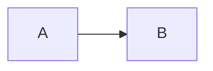

## Good Front Matter (updating):

```
---
math: true  # enable math mode
title: Notes for using this theme(Chirpy)
date: YYYY-MM-DD HH:MM:SS +0800 #UTC+8
categories: [Note]
tags: [chirpy,note,en]     # TAG names should always be lowercase
---
```

## Insert an Image:
```
{: w="700" h="400" .left}
```
Here, `left` can also be `right` and `normal`.

## Filepath Highlight
```
`/path/to/a/file.extend`{: .filepath}
```

## URL Link
```
[text](http://your/link/)
```

## Prompt
```
{: .prompt-info}
```
where `info` can be replaced by `tip`, `warning` and `danger`.
> this is a tip
{: .prompt-tip}
> this is a info
{: .prompt-info}
> this is a warning
{: .prompt-warning}
> this is a danger
{: .prompt-danger}

## Insert Videos

```liquid

```
```liquid

```
> if you don't want the above parts to be rendered, using `render_with_liquid: false` in the **Front Matter**
{: .prompt-tip}

## Useful Link
a possible useful link is [https://blandalpha.github.io/posts/Hello_World/](https://blandalpha.github.io/posts/Hello_World/)

## Some Advanced Markdown Tricks
you can draw many kinds of diagrams with 'mermaid' plugin that is already in chirpy theme:


and also almost any kinds of charts you want. See [tutorial of Mermaid](https://mermaid.js.org/intro/syntax-reference.html) for further information.
